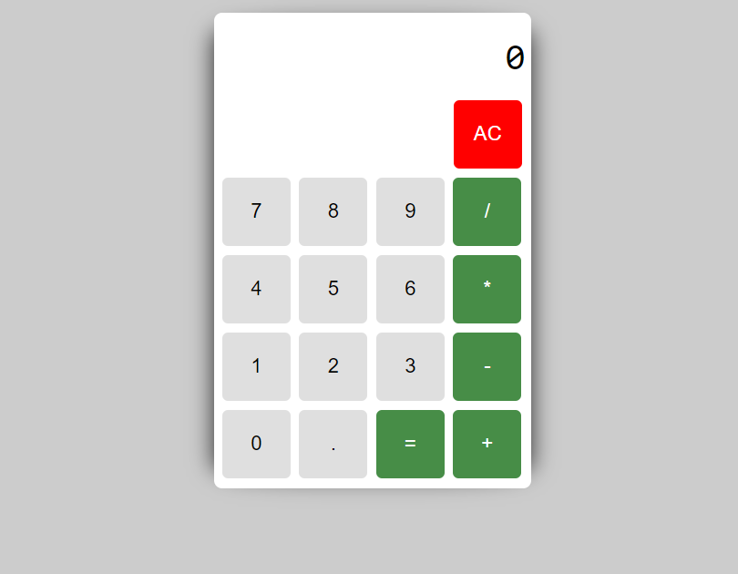

# HTML Calculator

This is a simple HTML calculator created to perform basic arithmetic operations. You can use this calculator to add, subtract, multiply, and divide numbers.

## Demo

You can see a live demo of the calculator [here](https://kalana0001.github.io/html-calculator/).

## Features

- Basic arithmetic operations: addition, subtraction, multiplication, and division.
- Clear button to reset the input.
- Responsive design for various screen sizes.

## Screenshots



## Getting Started

To get a local copy up and running, follow these simple steps.

### Prerequisites

You need a web browser to run this calculator.

### Installation

1. Clone the repo:
   ```sh
   git clone https://github.com/your-username/html-calculator.git
